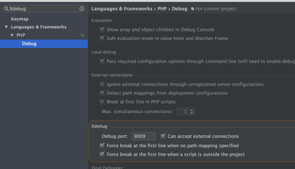
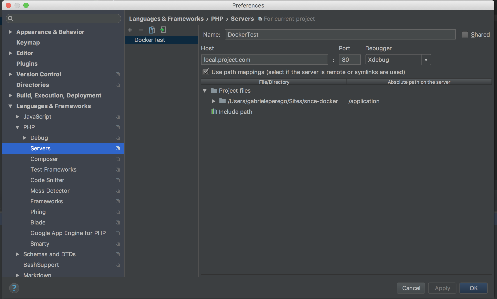
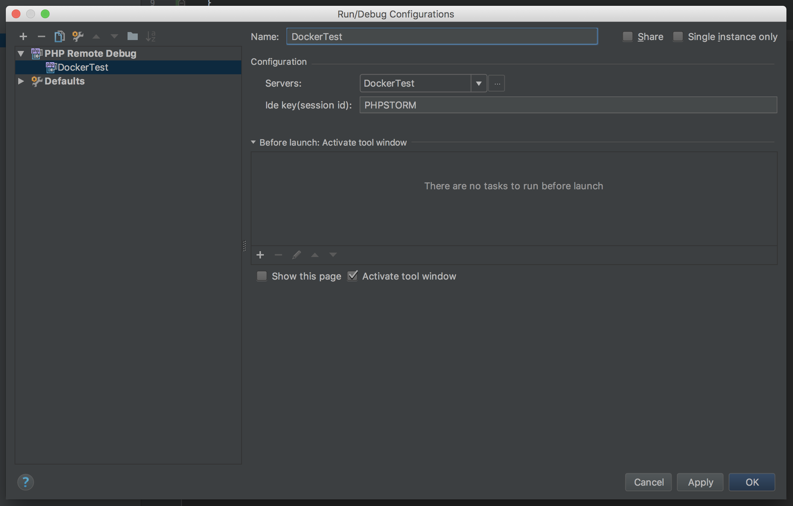
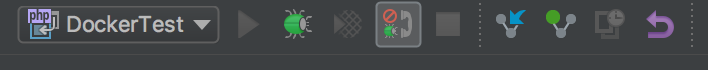

# S'nce Group basic PHP/Symfony Docker setup

Basic Docker setup to enable a quick start for Symfony based projects

## TODOs

- [x] Basic setup
- [x] Expose servie
- [x] Sequel PRO shortcut
- [x] MySQL proper volume mount
- [x] Xdebug
- [x] Symfony test
- [ ] eZ Publish test
- [x] Sulu test
 
## How to run

Dependencies:

  * [Docker for Mac](https://www.docker.com/community-edition#/download) > 17.12 must installed to use this setup

## Services exposed

| Service | Port | Notes |
| --- | --- | --- |
| NGINX | 8080 | --- |
| MySQL | 3306 | --- |
| Redis | 6379 | --- |

  * Nginx to port 8080
  * MySQL to port 3306
  * Redis to port 6379 

## Hosts within your environment

You'll need to configure your application to use any services you enabled:

| Service | Port | Notes |
| --- | --- | --- |
| php-fpm | 9000 | --- |
| MySQL | 3306 | --- |
| Redis | 6379 | --- |

## Sequel PRO connection script

`./open-db` directly opens Sequel PRO, options available using `-h`

## Env variable

an `.env` file is provided with some default settings

```
SYMFONY_ENV=prod
XDEBUG=0
XDEBUG_HOST=
PHP_TIMEZONE=Europe/Rome
PHP_DISPLAY_ERRORS=1
```

### Symfony environment

You can set an env variable in your host machine to decide which application env will be used by the application: `export SYMFONY_ENV=dev`

### Xdebug

xDebug can be enable exporting `XDEBUG` env variable, by default it is disabled.


## Docker compose cheatsheet

  * Start containers in background: `docker-compose up -d`
  * Start containers in background with a production configuration : `docker-compose -f docker-compose.yml -f docker-compose.prod.yml up -d`
  * Start containers on foreground: `docker-compose up`. You will see a stream of logs for every container running.
  * Stop containers: `docker-compose stop`
  * Kill containers: `docker-compose kill`
  * View container logs: `docker-compose logs`
  * Execute command inside of container: `docker-compose exec SERVICE_NAME COMMAND` where `COMMAND` is whatever you want to run. Examples:
    * Shell into the PHP container, `docker-compose exec php-fpm bash`
    * Run symfony console, `docker-compose exec php-fpm bin/console`
    * Open a mysql shell, `docker-compose exec mysql mysql -uroot -pCHOSEN_ROOT_PASSWORD`

## PHPStorm remote debug setup (on macOS)

Following this instruction you will be able to debug your application using PHPStorm and Xdebug. This approach require Docker > 18.03 because it relies on a special Mac-only DNS name `host.docker.internal` which will resolve to the internal IP address used by the host.

### Configure Xdebug port

To start Xdebug must be enabled on the proper port in PHPStorm settings.



### Server configuration

In order to allow connection we need to configure the server where our code is, with `⌘ ,` again, and searching for “server”, we need to add a new one with the symbol "+", set the name we prefer, configure the domain, and the port where our docker container is listen. Then we need to click in the option "Use path mapping …", automatically PHPStorm is going to show the tree directory of our project, in the column "Absolute path on the server" we need to add the path of our project in the container, in our case is `/application`.

**Always use an host name (local.project.com is the configured one) and port 80**



### Debug configuration

Under Run -> Configuration click "+" and create a new `PHP Remote Debug` entry, choose a name and select the server created in the previous step. As Ide Key user `PHPSTORM` (it is already configured in the `xdebug.ini` file). This is the result:



### Listen incominc Xdebug connections

To actually start debugging you have to enable Xdebug connection on PHPStorm. You can use the handy toolbar to do so (selecting your already configured server).



### Happy debug

Refresh your page or re-run your cli script to start debugging.

## Recommendations

  * Run composer outside of the php container, as doing so would install all your dependencies owned by `root` within your vendor folder.
  * Run commands (ie Symfony's console) straight inside of your container. You can easily open a shell as described above and do your thing from there.

## Credits
[PHPDocker](https://phpdocker.io/generator)
[Xdebug with Docker and PHPStorm](https://medium.com/@pablofmorales/xdebug-with-docker-and-phpstorm-786da0d0fad2)

## License
[MIT](/LICENSE)